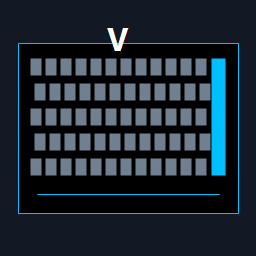

# Vanguard Volume



Vanguard Volume is a Windows notification-area companion for the Corsair VANGUARD 96. It maps configurable iCUE/Web Hub macro-key bindings to master and per-application audio controls.

## Features

- **G1** controls the default output's master volume.
- **G2-G6** receive stable assignments to up to five active shared-mode audio applications.
- The dial adjusts the selected target; pressing it toggles mute.
- Macro selection opens the Windows taskbar volume panel and targets its **Volume mixer** control through UI Automation.
- Bind each physical G key to a unique **F13-F24** key, then configure the same bindings in the app.
- Runs in the background from the notification area and can start automatically at sign-in.

## Install

Download `VanguardVolume-Setup.exe` from the latest GitHub release and run it. The per-user installer requires no administrator permissions, installs to `%LOCALAPPDATA%\Programs\VanguardVolume`, and launches the background companion.

To build an installer locally:

```powershell
winget install --id JRSoftware.InnoSetup --exact
.\build-installer.ps1
```

The resulting installer is `artifacts\installer\VanguardVolume-Setup.exe`.

## Configure the keyboard

1. Open the Vanguard Volume notification-area icon and choose **Show mapping**.
2. Select a unique F13-F24 binding for every G1-G6 key and choose **Save bindings**.
3. Assign those same function keys to the physical macro keys in iCUE or Corsair Web Hub.
4. Enable **Start Vanguard Volume automatically when I sign in** if it should survive reboots.

Settings are stored at `%LOCALAPPDATA%\VanguardVolume\settings.json` and apply immediately.

## Development

```powershell
dotnet test VanguardVolume.slnx
dotnet run --project .\VanguardVolume.App
```

Pushing a `v*` tag runs the release workflow, creates the self-contained x64 installer, and attaches it to a GitHub Release.

## Constraints

Corsair does not publish a supported live LCD/framebuffer API for the VANGUARD 96, so the app uses the native Windows audio panel rather than attempting unsupported HID or firmware writes. The first version also suppresses standard Windows media-volume events while it is active because the low-level hook cannot yet distinguish the originating keyboard; map the VANGUARD dial to standard media volume keys.
